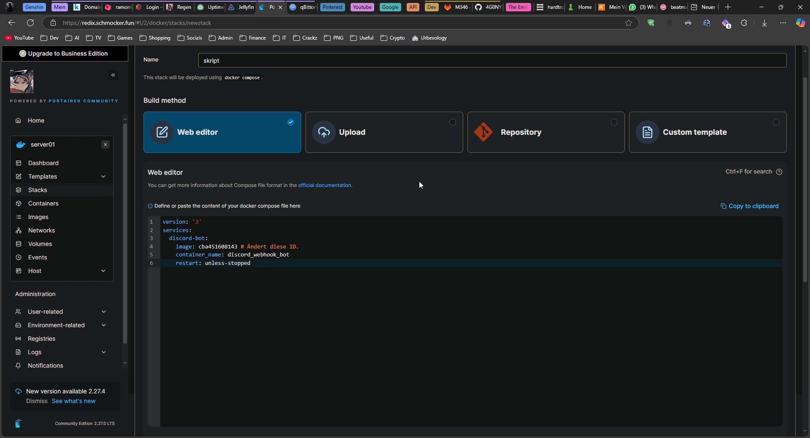

# FZAG-BBC-AWS-Tutorial
Die Aufträge, welche ich mit den Bbc-Menschen durchführen werde. In diesen werden wir: Einen Linux-Server in AWS (Localstack) mithilfe eines cloud-init.yml erstellen (EC2), auf dieser Instanz Docker installieren, innerhalb von Docker Portainer einrichten sowie ein Python-Skript schreiben, welches wir dann mit Docker-Compose ausführen (Portainer)

# Was ihr lernen werdet:

 - Basics vom APT Package Manager
 - Interaktion mit der Bash-Shell
 - Installieren von Localstack
 - Basics der AWS-CLI Interaktionen
 - AWS-SSH Keypair erstellen
 - AWS Firewall konfigurieren
 - EC2-Instanz aufsetzen
 - Docker in der EC2 Instanz aufsetzen
 - Schreiben eines Docker-Compose Files
 - Erstellen eines eigenen Docker-Images
 - Aufsetzen von Portainer
 - Basics von Portainer
 - Python-Skripting mit Webhook-Integration
 - Containerizen dieses Python-Skripts
 - Erstellen eines cloud-init.yml Files

## Kompetenznachweise:
Gibt es nicht, wir sind nicht in der Schule ;)


# Localstack aufsetzen

Als erstes müssen wir logischerweise mal eine "eigene" AWS-Cloud aufsetzen. Das können wir mithilfe von [Localstack](https://github.com/localstack/localstack).

## To-Do

- VM mit [Ubuntu Server 22.04.2 LTS](https://ubuntu.com/download/server/thank-you?version=24.04.2&architecture=amd64&lts=true) aufsetzen.
- In dieser VM [Docker installieren](https://docs.docker.com/engine/install/ubuntu/)
- [Localstack installieren](https://docs.localstack.cloud/getting-started/installation/#docker) Hier wichtig: Wir installieren die Community-Version. Diese unterstützt alles was wir heute brauchen (EC2)

## VM mit Ubuntu Server aufsetzen

Erstellt eine VM mit 8GB RAM und 4 vCPU-Cores. Öffnet dann das VMWare Remote Tool, startet die VM und fügt das Ubuntu-ISO hinzu. Nun startet ihr die VM neu und installiert Ubuntu Server. Hier ist folgendes wichtig:
 - Das richtige Tastaturlayout nehmen
 - Benutzernamen und Passwort merken
 - Keine Zusatzpakete installieren
 - Die IP eurer VM merken (Am besten eine statische IP!)

## Docker installieren

Mithilfe der VMWare Remote Tools installiert ihr Docker. Dies könnt ihr mit folgenden Befehlen machen: (Ja, ihr könnt Copy-Pasten, ich erkläre aber trotzdem was jeder dieser Befehle macht :3)


```
for pkg in docker.io docker-doc docker-compose docker-compose-v2 podman-docker containerd runc; do sudo apt-get remove $pkg; done
```
Hiermit entfernen wir alle APT-Pakete, welche einen Konflikt auslösen könnten. (Werden keine sein, da wir frische Installationen haben.)

```
sudo apt update
```
Nun updaten wir die APT-Datenbanken

```
sudo apt install ca-certificates curl
```
Dies sind die benötigten Pakete, um das Docker-APT Repository hinzuzufügen.

```
sudo install -m 0755 -d /etc/apt/keyrings
```
Hier installieren wir die Keyrings. Jedes Repository hat Keys, um die "Authentität" und die "Sicherheit" zu garantieren.

```
sudo curl -fsSL https://download.docker.com/linux/ubuntu/gpg -o /etc/apt/keyrings/docker.asc
```
Hier hinterlegen wir den Key für das Docker-Repository.

```
sudo chmod a+r /etc/apt/keyrings/docker.asc
```
Nun setzen wir noch die korrekten File-Berechtigungen.

```
echo \
  "deb [arch=$(dpkg --print-architecture) signed-by=/etc/apt/keyrings/docker.asc] https://download.docker.com/linux/ubuntu \
  $(. /etc/os-release && echo "${UBUNTU_CODENAME:-$VERSION_CODENAME}") stable" | \
  sudo tee /etc/apt/sources.list.d/docker.list > /dev/null
```
Nun fügen wir das Docker-APT Repository hinzu und "sagen" APT welche Keys zu diesem Repository gehören.

```
sudo apt update
```
Nun aktualisieren wir die APT-Datenbank nochmals, dass die Docker-Pakete auch in der lokalen Datenbank von APT auftauchen.

```
sudo apt install docker-ce docker-ce-cli containerd.io docker-buildx-plugin docker-compose-plugin
```
Und hiermit installieren wir nun Docker und die wichtigsten Plugins.

Nun haben wir Docker auf unserem neuen Server installiert. Wenn ihr jedoch einen docker-Befehl ohne sudo ausführen wollt, fehlen euch die Rechte. Theoretisch könnten wir einfach alles mit sudo machen, das ist jedoch unschön.

### Docker-Berechtigungen
Um nicht alles mit sudo ausführen zu müssen (Least-Privilege) fügen wir euren Benutzer noch in die docker-Gruppe. Das machen wir wie folgt:
```
sudo groupadd docker
```
Falls es die docker-Gruppe aus irgendwelchen Gründen nicht bei der Installation erstellt hat, machen wir das manuell. Kaputt machen können wir mit diesem Befehl nicht viel.

```
sudo usermod -aG docker $USER
```
Und nun fügen wir den momentanen Benutzer (in der ENV-Variable $USER) in die Docker-Gruppe. Durch diese Variable könnt ihr auch diesen Befehl Copy-Pasten.

## Localstack installieren
Localstack können wir relativ einfach installieren. Ebenfalls gibt es zwei verschiedene Wege um Localstack zu installieren, entweder können wir Docker verwenden oder eine Bare-Metal installation. Wie genau ihr das angeht ist euch überlassen :)

### Bare-Metal:

```
curl --output localstack-cli-4.3.0-linux-amd64-onefile.tar.gz --location https://github.com/localstack/localstack-cli/releases/download/v4.3.0/localstack-cli-4.3.0-linux-amd64-onefile.tar.gz
```
Hier holen wir die schon Kompilierten Binaries von Localstack und speichern diese lokal als .tar.gz

```
sudo tar xvzf localstack-cli-4.3.0-linux-*-onefile.tar.gz -C /usr/local/bin
```
Nun extrahieren wir diese Datei in's /bin-Verzeichnis.

Um das ganze zu testen, können wir folgenden Befehl verwenden:
```
localstack --version
```

Wenn wir hier einen Output erhalten, war die Installation erfolgreich. 
Nun geht's (fast) weiter mit dem Aufsetzen einer EC2-Instanz.

### In Docker:
```
docker run --rm -it -p 4566:4566 -p 4510-4559:4510-4559 -v /var/run/docker.sock:/var/run/docker.sock localstack/localstack
```

Was genau macht dieser Befehl?

```
docker run
```
Hiermit erstellen & starten wir einen neuen Docker Container

```
--rm
```
Dieser Teil löscht den Befehl automatisch sobald er gestoppt wird, sodass keine unnötigen Container "liegen" bleiben. (Den Container welchen wir händisch starten startet die "echten" Container)

```
-it
```
Sind zwei eigene "Optionen", -i ist für den interaktiven Modus (Dass wir auf die Konsole des Containers zugreifen können) und mit -t weisen wir ein Terminal zu (Für die Benutzerfreundlichkeit)

```
-p 4566:4566 -p 4510-4559:4510-4559
```
Hiermit leiten wir die Host-Ports (von unserem Server) an die Ports unseres Docker-Containers weiter. In diesem Fall den Host-Port 4566 auf den Container-Port 4566 und dasselbe mit der Port-Range 4510-4559.

```
-v /var/run/docker.sock:/var/run/docker.sock
```
Hiermit binden wir den Host-Docker Sock (ist eine Datei) an unseren Container an. Somit kann unser Container mit Docker auf unserem Server kommunizieren.

```
localstack/localstack
```
Hier definieren wir, welches Docker Image unser Container nutzen wird.

## AWS-CLI & AWS-CLI-local installieren

Um Localstack ohne permanente HTTP-API-Calls nutzen zu können brauchen wir jedoch noch aws-cli sowie aws-cli-local. Also installieren wir das ganze jetzt.

### AWS-CLI
Eine der Abhängigkeiten von AWS-CLI ist unzip. Für AWS-CLI-local benötigen wir ebenfalls pipx. Also installieren wir als erstes diese beiden Abhängigkeiten.
```
sudo apt install unzip pipx -y
```

So, jetzt können wir AWS-CLI installieren.

```
curl "https://s3.amazonaws.com/aws-cli/awscli-bundle.zip" -o "awscli-bundle.zip"
```

Als erstes laden wir den gezippten Installer herunter.
Diese müssen wir jetzt unzippen.

```
unzip awscli-bundle.zip
```

Nun können wir den Installer ausführen.
```
sudo ./awscli-bundle/install -i /usr/local/aws -b /usr/local/bin/aws
```

So, jetzt haben wir aws-cli installiert. Bleibt bloss noch aws-cli-local. Dies haben wir jedoch mit einem Befehl (zuzüglich einem Befehl zum aktualisieren unserer PATH-Variablen) erledigt.

```
pip install awscli-local --break-system-packages
```

Wenn hier kein Error erscheint, war es ein Erfolg.

# EC2-Instanz innerhalb von Localstack aufsetzen.

## To-Do
 - Localstack starten
 - Ein EC2-Keypair erstellen
 - Firewall-Rules erstellen
 - Die EC2-Instanz erstellen
 - Bei der EC2-Instanz einloggen

## Localstack starten

### Bare-Metal Installation

```
screen
```

Hiermit machen wir eine "virtuelle" zweite Shell, sodass wir trotzdem noch mit unserem Server interagieren können.

```
sudo localstack start
```
Nun sollten wir das Localstack-Logo in ASCII-Art sowie einige Informationen sehen. Wenn das korrekt ist und keine Fehlermeldungen auftreten, sind wir schonmal gut.

Um wieder aus dem screen herauszukommen, klickt **CTRL + A** und danach **D**


### Docker Installation
Wenn ihr euch für den Docker-Weg entschieden habt sieht das starten etwas anders aus:

```
screen
```

```
docker run --rm -it -p 4566:4566 -p 4510-4559:4510-4559 -v /var/run/docker.sock:/var/run/docker.sock localstack/localstack
```

Nun sollten wir das Localstack-Logo in ASCII-Art sowie einige Informationen sehen. Wenn das korrekt ist und keine Fehlermeldungen auftreten, sind wir schonmal gut.

Um wieder aus dem screen herauszukommen, klickt **CTRL + A** und danach **D**


## EC2-Keypair erstellen

Um auf eine EC2-Instanz zuzugreifen müssen wir ein SSH-Keypair erstellen. Dies können (und müssen) wir mit Localstack. Das geht wie folgt:

```
awslocal ec2 create-key-pair --key-name bbc-key --query 'KeyMaterial' --output text | tee key.pem
```

Jetzt haben wir das Keypair "bbc-key" erstellt und den PRIVATE Key (Wisst ihr was der Unterschied zwischen Private und Public Key ist?) in der Datei "key.pem" im momentanen Verzeichnis gespeichert. Was jedoch ein Stolperstein ist: Private Keys MÜSSEN minimale Dateisystem-Berechtigungen haben, sonst verweigert SSH diese. Die momentanen Berechtigungen sind zu "offen", somit müssen wir diese anpassen:

```
sudo chmod 400 key.pem
```

Hier setzen wir die Berechtigungen für den key sodass nur der Besitzer (euer Benutzer) schreibgeschützte Berechtigungen darauf hat. 


## Firewall-Rules setzen

Da wir einige Netzwerk-Ports brauchen werden, müssen wir ein paar Firewall-Rules erstellen.
Dies machen wir ebenfalls über die awslocal (Localstack) CLI.

Generell ist der SSH-Port 22 freigeschaltet, da eine "unzugreifbare" EC2-Instanz recht unnütz wäre. Somit müssen wir diesen Port nicht freischalten.

Fangen wir mit den Ports für unser Portainer an:
```
awslocal ec2 authorize-security-group-ingress --group-id default --protocol all --port 8000 --cidr 0.0.0.0/0
```
```
awslocal ec2 authorize-security-group-ingress --group-id default --protocol tcp --port 9443 --cidr 0.0.0.0/0
```

Nun haben wir den Port 8000 für alle Protokolle freigeschaltet und den Port 9443 (zukünftiges Portainer WebUI) für TCP. (HTTPS nutzt TCP)

Jetzt haben wir zwar die Security Group erstellt, jedoch kennen wir die ID der Security Group (Firewall) noch nicht. Diese ID können wir mit folgendem Befehl herausfinden:

```
sg_id=$(awslocal ec2 describe-security-groups | jq -r '.SecurityGroups[0].GroupId')
echo $sg_id
```

Nun können wir unsere erste AWS EC2-Instanz starten!

## EC2-Instanz starten

Nun haben wir fast alles vorbereitet, dass wir unsere EC2-Instanz starten können. Was jedoch noch fehlt ist ein cloud-init.yml File. Dieses ist zwar nicht unbedingt benötigt, jedoch können wir beispielsweise die Installation von Docker und das erstellen unserer Benutzer automatisieren. Ein Beispiel findet ihr hier: [cloud-init.yml](./cloud-init.yml).

Gerne könnt ihr es anpassen, den Benutzernamen ändern, Pakete hinzufügen welche installiert werden sollen und so weiter und so fort.

Sobald ihr euer cloud-init.yml File nach belieben angepasst habt, speichert es in das Home-Verzeichnis eures Servers (Oder wo auch immer sonst ihr den untenstehenden Befehl ausführen wollt)

Nun starten wir unsere lokale EC2-Instanz:

```
awslocal ec2 run-instances --image-id ami-ff0fea8310f3 --count 1 --instance-type t3.nano --key-name bbc-key --security-group-ids $sg_id --user-data ./cloud-init.yml
```

Sofern es jetzt keine Errors gab, habt ihr eine EC2-Instanz mithilfe eines Cloud-init.yml Files aufgesetzt!

## Bei der EC2-Instanz einloggen

Einloggen können wir uns über SSH von eurem Ubuntu-Server.
Wenn ihr den Benutzernamen im Cloud-Init.yml nicht angepasst habt, ist das der Befehl dazu:
```
ssh ubuntu@[EURE_IP] -i bbc-key
```

Nun solltet ihr auf eurer EC2-Instanz angemeldet sein. Dank dem cloud-init.yml Files müsst ihr auch bei sudo-Befehlen kein Passwort eingeben. 
Was jedoch sein kann ist dass ihr bei der -i Option den genauen Pfad zu eurem Private Key spezifizieren müsst. Das könnte Beispielsweise so aussehen:
```
ssh ubuntu@[EURE_IP] -i /home/ramon/bbc-key.pem
```

# Portainer installieren

Nun habt ihr SSH-Zugriff auf eure EC2-Instanz. Um nun Portainer zu installieren reicht ein einziger Befehl:
```
docker run -d -p 8000:8000 -p 9443:9443 --name portainer --restart=always -v /var/run/docker.sock:/var/run/docker.sock -v portainer_data:/data portainer/portainer-ce:lts
```

Hiermit installieren wir Portainer und mappen die korrekten Ports. Da unser Ubuntu-Server keine grafische Oberfläche hat, können wir einfach eine andere VM in's selbe Netzwerk tun und dort im Browser https://IP_EURES_UBUNTU_SERVERS:9443 öffnen, dort können wir dann Portainer bequem mit "Klicki-Bunti" (WebUI) konfigurieren.

# Python-Skript schreiben

Was genau für ein Python-Skript ihr schreibt ist für diese Aufgabe relativ egal. Falls ihr keine Lust auf Python habt oder die Zeit nicht reicht (oder einfach "Inspiration" haben möchtet ;) habe ich euch ein Beispielsskript gebastelt. Dies findet ihr hier: [webhook.py](./webhook.py)

# Docker Image erstellen

Jedes Programm, welches in Docker läuft, braucht ein Dockerimage. Dieses Image ist wie eine Art "Template", mit welchem dann mithilfe von Docker-Compose oder Docker run Container erstellt werden können. Je nach dem was für ein Python-Skript ihr bastelt wird dieses File variieren. Wenn ihr mein Python-Skript verwendet könnt ihr auch mein Dockerfile nutzen: [Dockerfile](./Dockerfile)

Nun haben wir zwei Optionen: Das Image manuell bauen oder direkt mit Docker Compose. Wie ihr das macht ist euch überlassen.

## Manuell

Um das ganze nun zu "bauen" können wir das Dockerfile zusammen mit [webhook.py](./webhook.py) und [requirements.txt](./requirements.txt) in einen Ordner auf unserem ubuntu-Server tun und dann den folgenden Befehl ausführen:
```
docker build .
```

Jetzt haben wir lokal ein Image von unserem Skript und den Abhängigkeiten. Um das Image zu nutzen, brauchen wir jedoch den Namen des Images. Diesen finden wir wie folgt heraus:
```
docker images
```

Dort sehen wir dann alle lokal verfügbaren Images. In eurem Fall wird das genau eins sein. Von dem könnt ihr nun die ID kopieren und in [dieses Docker-Compose](./docker-compose-m.yml) file einfügen. 

## Automatisch

Wenn ihr das Image nicht manuell mit docker build bauen wollt, könnt ihr auch einfach den Pfad zu eurem Dockerfile (in einem Ordner in welchem auch [webhook.py](./webhook.py) und [requirements.txt](./requirements.txt) sind) einfügen. Dies würdet ihr in [diesem Docker-Compose](./docker-compose-a.yml) machen.

# Portainer nutzen

Nun haben wir alle Abhängigkeiten, sodass wir unser containerizedes Skript über Portainer deployen können. Geht zurück zu eurem Portainer und meldet euch mit den Daten, welche ihr beim einrichten von Portainer gewählt habt, an. Dort klickt ihr auf die **lokale Umgebung** und dort auf **Stacks**.

Nun könnt ihr auf **Add Stack** klicken. 

In diesem Menü müsst ihr euer Docker-Compose.yml File (den Inhalt) einfügen.

Das ganze könnte dann so ungefähr so aussehen:


Nun könnt ihr unten auf **Deploy the stack** klicken. 

Wenn das ganze ohne Fehlermeldungen verläuft und eure Webhook dann eine Message sendet habt ihr diese kleine Einführung erfolgreich abgeschlossen :)